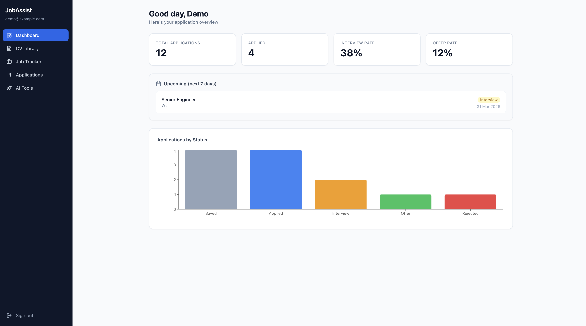
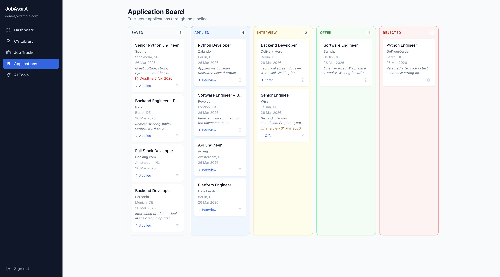
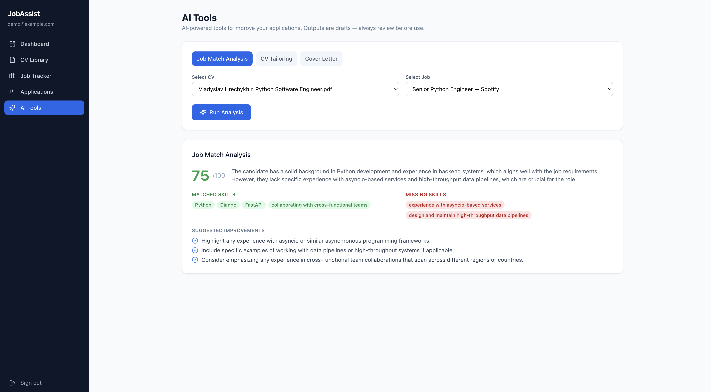

# Job Application Assistant

Track your job search, tailor your CV with AI, and generate cover letters — built for the European job market.

**Live:** [accurate-grace-production-abf0.up.railway.app](https://accurate-grace-production-abf0.up.railway.app) &nbsp;·&nbsp; **Stack:** React · FastAPI · PostgreSQL · Docker

---

## Screenshots

| Dashboard | Kanban Board | AI Job Match |
|-----------|-------------|--------------|
|  |  |  |

---

## Features

- Kanban pipeline — drag-and-drop board; SAVED → APPLIED → INTERVIEW → OFFER / REJECTED
- AI job match — score your CV against a job description; see matched skills, gaps, and suggestions
- CV tailoring — AI rewrites your bullet points to match the job requirements
- Cover letter generation — full draft from your CV + job description
- Job URL import — paste a posting URL; AI extracts title, company, location, and description
- CV upload — PDF and DOCX parsing with per-user file storage
- Profile page — name, AI quota usage with live progress bar and reset time
- JWT authentication — access + refresh tokens; rate-limited login and registration
- AI spend controls — per-user daily quota, input length limits, cached results skip the provider

## Tech

| Layer | Tech |
|---|---|
| Frontend | React 18, TypeScript, Vite, Tailwind CSS, TanStack Query |
| Backend | FastAPI, SQLAlchemy 2, Alembic, Pydantic v2 |
| AI | OpenAI-compatible API (`gpt-4o-mini` by default) |
| Database | PostgreSQL 16 |
| Infra | Docker Compose (local), Railway (production), GitHub Actions CI |

## Architecture

```
Browser → nginx (port 80)
              ├── /        → React SPA (static files)
              └── /api/*   → FastAPI backend (port 8000)
                                 ├── PostgreSQL (jobs, applications, CVs, AI cache)
                                 ├── Local volume (CV file storage)
                                 └── OpenAI API (AI features)
```

## API

| Method | Path | Description |
|---|---|---|
| `POST` | `/api/v1/auth/register` | Register a new user |
| `POST` | `/api/v1/auth/login` | Obtain access + refresh tokens |
| `GET` | `/api/v1/jobs` | List saved jobs. Supports `?status=`, `?q=` |
| `POST` | `/api/v1/jobs` | Create a job (manual or URL import) |
| `GET` | `/api/v1/applications` | List applications with pipeline status |
| `POST` | `/api/v1/ai/match` | Score CV against a job description |
| `POST` | `/api/v1/ai/tailor` | Rewrite CV bullets for a job |
| `POST` | `/api/v1/ai/cover-letter` | Generate a cover letter |

Full interactive docs at `/docs` (Swagger) and `/redoc`.

## Run locally

**Prerequisites:** Docker Desktop

```bash
git clone https://github.com/hrechykhin/job-application-assistant.git
cd job-application-assistant
cp backend/.env.example backend/.env
# Edit backend/.env — set OPENAI_API_KEY
docker compose up --build
```

| Service | URL |
|---|---|
| App | http://localhost |
| API docs | http://localhost:8000/docs |
| Health check | http://localhost:8000/health |

Load demo data (optional):

```bash
docker compose exec backend python seed_demo.py
# Login: demo@example.com / Demo1234!
```

## Tests

```bash
# Backend (SQLite in-memory, no services needed)
cd backend && pytest tests/ -v

# Frontend
cd frontend && npm test -- --run
```

## License

[MIT](LICENSE)
